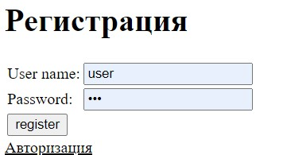
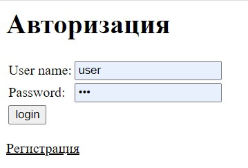

# job4j_forum
В данном репозитории будет реализовано приложение - форум.
В процессе реализации будет использоваться Spring framework, а именно модули
core, mvc, security, boot.

Визуализация приожения:

