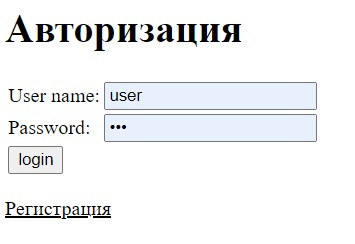
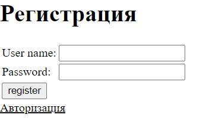
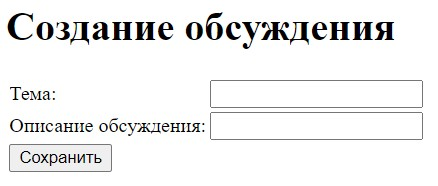

# job4j_forum
- В данном репозитории будет реализовано приложение - форум.
- В процессе реализации будет использоваться Spring framework, а именно модули
core, mvc, security, boot, test(mockito). Также приложение развертвывается на heroku.

- Визуализация приожения:
 
 
 
 
 

